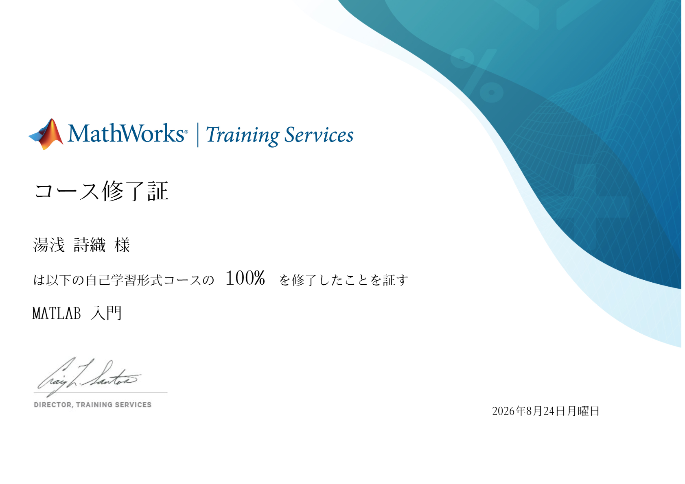

# ポートフォリオ
学習・開発ポートフォリオ

取得した修了証・スキル

🪪 MATLAB入門コース　修了証（取得日：2026/8/24）
  * 修了証リンク: [MathWorks公式証明書](https://matlabacademy.mathworks.com/progress/share/certificate.html?id=9abb7fba-e965-43c4-88ea-42752b35dc45)
  * **学びの概要:** 行列計算、グラフ描画、基本的なスクリプト作成の基礎を習得しました。今後はこれを応用して、簡易的な航空機の運動方程式や制御シミュレーションのコード作成に挑戦していきます。

🚀 制作物・プロジェクト実績

* **恒星の運動シミュレーション（MATLAB入門 最終プロジェクト）**（取得日：2026/8/24）
  * **使用ツール:** MATLAB
  * **概要:** 恒星のスペクトルデータから赤方偏移と後退速度を計算し、波長と強度をグラフ化するプログラムを作成しました。
  * **主な処理・コード:**
    * データのロードと測定パラメータの定義
    * 最小値のインデックス取得（`min`関数によるスペクトルの特定）
    * 2次元グラフの描画（`plot`関数、マーカーの追加、軸ラベルの設定）
    * 波長データから赤方偏移量 $z$ と速度を算出
   

nObs = 357
lambdaStart = 630.0200
lambdaDelta = 0.1400
lambdaEnd = 679.8600
lambda = 1×357
  630.0200  630.1600  630.3000  630.4400  630.5800  630.7200  630.8600  631.0000  631.1400  631.2800  631.4200  631.5600  631.7000  631.8400  631.9800  632.1200  632.2600  632.4000  632.5400  632.6800  632.8200  632.9600  633.1000  633.2400  633.3800  633.5200  633.6600  633.8000  633.9400  634.0800  634.2200  634.3600  634.5000  634.6400  634.7800  634.9200  635.0600  635.2000  635.3400  635.4800  635.6200  635.7600  635.9000  636.0400  636.1800  636.3200  636.4600  636.6000  636.7400  636.8800

s = 357×1
1.0e-12 *

    0.1340
    0.1338
    0.1347
    0.1357
    0.1354
    0.1343
    0.1335
    0.1325
    0.1335
    0.1329
    0.1313
    0.1320
    0.1339
    0.1334
    0.1313

sHa = 7.2400e-14
idx = 187
lambdaHa = 656.0600

xlim([6.3000e+02, 6.8000e+02])

ylim([7.0000e-14, 1.4000e-13])

z = -3.3522e-04

speed = -100.4973

  * **作成したファイル:** [Stellar motion.m](https://github.com/velkroviet/Portfolio/blob/main/Stellar%20motion.m)
